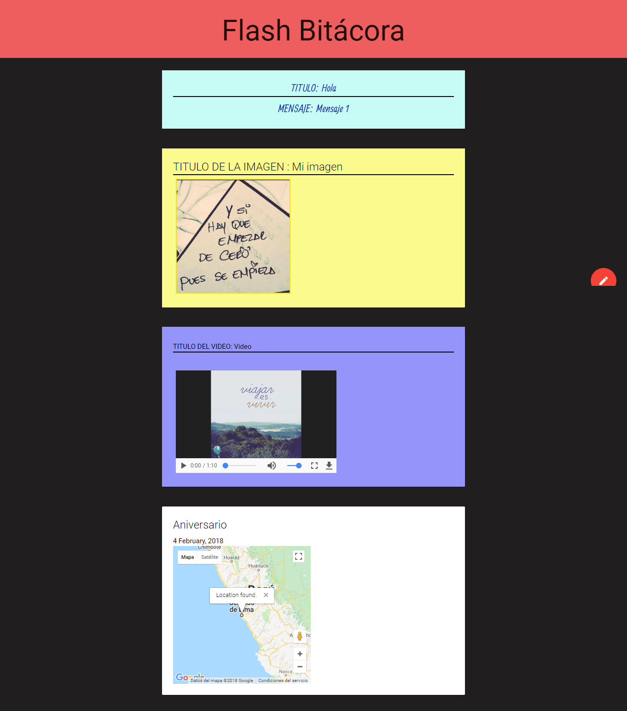

# FLASH BITÁCORA

## Objetivo:

+ Crear una bitácora con la que podrás agregar mensajes, imágenes, audio, video, ubicaciones y fechas.

## Flujo de la aplicación:

## Herramientas:

+ HTML5 API
+ Google maps API
+ Javascript
+ CSS3
+ HTML5

## Créditos:

+ Nefeli Joñoruco.
+ Patricia Urco.